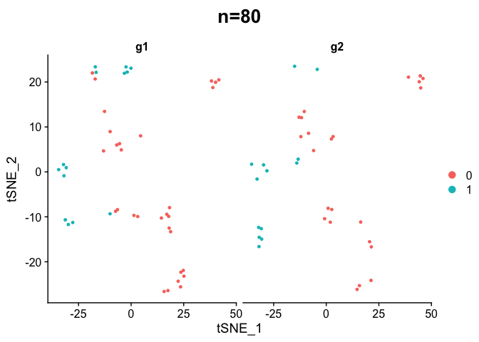
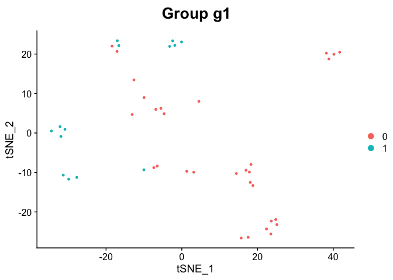

<!-- README.md is generated from README.Rmd. Please edit that file -->

# seurathelpeR

<!-- badges: start -->

<!-- badges: end -->

The goal of seurathelpeR is to provide convenience functions for working
with Seurat v3 objects.

## Installation

You can install seurathelpeR from [GitHub](https://github.com/) with:

``` r
# install.packages("devtools")
devtools::install_github("genomics-kl/seurathelpeR")
```

## Usage

Below are some examples of how to use the functions in seurathelpeR.

``` r
library(seurathelpeR)
#> seurathelpeR contains convenience scripts for working with the Seurat v3 package.
```

### Count cells

Count the number of cells classified by two grouping variables and
calculate
percentages.

``` r
count_cells(seurat_obj = pbmc_small, group_by_var = "groups", subgroup_var = "RNA_snn_res.0.8")
#> Registered S3 method overwritten by 'R.oo':
#>   method        from       
#>   throw.default R.methodsS3
#> # A tibble: 4 x 4
#>   groups RNA_snn_res.0.8     n  perc
#>   <chr>  <fct>           <int> <dbl>
#> 1 g1     0                  30  68.2
#> 2 g1     1                  14  31.8
#> 3 g2     0                  23  63.9
#> 4 g2     1                  13  36.1
```

Count the number of cells classified by just one grouping variable and
calculate percentages.

``` r
count_cells(seurat_obj = pbmc_small, group_by_var = "groups")
#> # A tibble: 2 x 3
#>   groups     n  perc
#>   <chr>  <int> <dbl>
#> 1 g1        44   55.
#> 2 g2        36   45
```

### Add title to Seurat plots

Seurat provides functions for many useful plots. Sometimes it is useful
to add a ‘title’ to those plots to convey extra information.

``` r
# total number of cells in the title
add_title_ggplot(ggplot_obj = Seurat::DimPlot(pbmc_small, group.by = "RNA_snn_res.0.8", split.by = "groups"), plot_title = paste0("n=",(length(Seurat::Idents(pbmc_small)))))
```



``` r

# indicate how cells have been subsetted
add_title_ggplot(ggplot_obj = Seurat::DimPlot(subset(pbmc_small, subset = groups == "g1"), group.by = "RNA_snn_res.0.8"), plot_title = "Group g1")
```



### Metrics table

It may be useful to obtain exact numbers for the standard filtering
metrics as shown in the Seurat vignettes. The regex parameter can be
used to parse out the cell name prefix that indicates the library; if a
valid regex is provided, metrics will be calculated separately for each
library. In this example, the data has no prefix so all the cells are
calculated
together.

``` r
seurat_fetch_dat <- Seurat::FetchData(pbmc_small, vars = c("nFeature_RNA", "nCount_RNA"))
head(rownames(seurat_fetch_dat))
#> [1] "ATGCCAGAACGACT" "CATGGCCTGTGCAT" "GAACCTGATGAACC" "TGACTGGATTCTCA"
#> [5] "AGTCAGACTGCACA" "TCTGATACACGTGT"

table_summary_seurat(seurat_fetch_dat, "^\\S+(?=_[ACGT]+$)")
#> $nFeature_RNA
#> # A tibble: 1 x 6
#>   lib   perc25 median perc75 perc90 perc95
#>   <chr>  <dbl>  <dbl>  <dbl>  <dbl>  <dbl>
#> 1 <NA>    42.8   51.5   71.2     81   84.1
#> 
#> $nCount_RNA
#> # A tibble: 1 x 6
#>   lib   perc25 median perc75 perc90 perc95
#>   <chr>  <dbl>  <dbl>  <dbl>  <dbl>  <dbl>
#> 1 <NA>     107    180   327.   467.   711.
```
